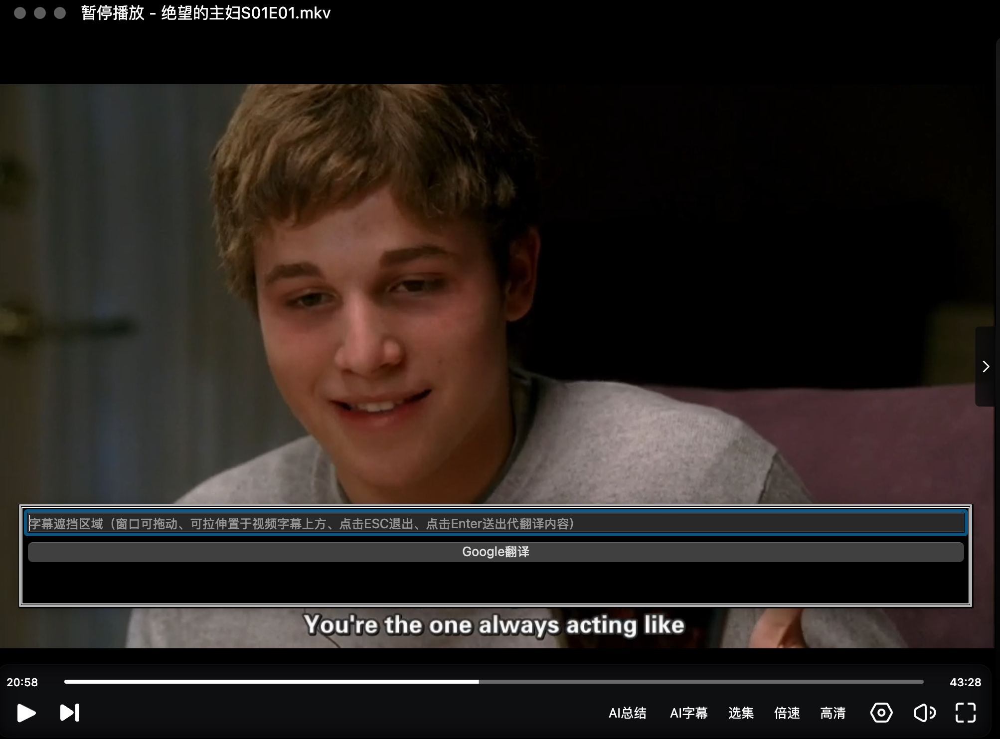

# Subcover —— 字幕遮挡翻译工具

一个简单的字幕遮挡与机器翻译悬浮窗工具，适用于视频字幕自助遮挡和一键翻译辅助。（适配 macOS，基于 PyQt5 与 Google Translate API）



## 特性

- **可拖动可拉伸的无边框悬浮窗**，总在最上层，不被其他窗口遮挡
- **黑色背景与白灰色细边框**，遮挡字幕区域美观可视
- **一行输入框（支持粘贴/输入字幕）**
- **回车键直接自动翻译（调用Google翻译）**
- **ESC键一键退出窗口**
- **可定制应用图标**
- 支持 Apple Silicon（M1/M2）macOS 环境

## 快速安装方法

1. **准备 Python 环境**
   ```sh
   python3 -m venv venv
   source venv/bin/activate
   pip install -r requirements.txt    # 或手动安装 PyQt5 requests